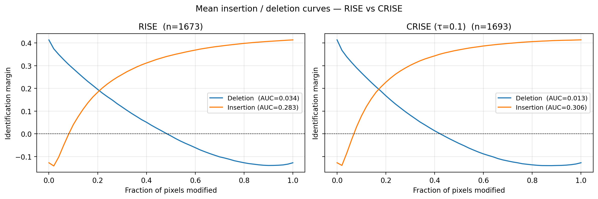
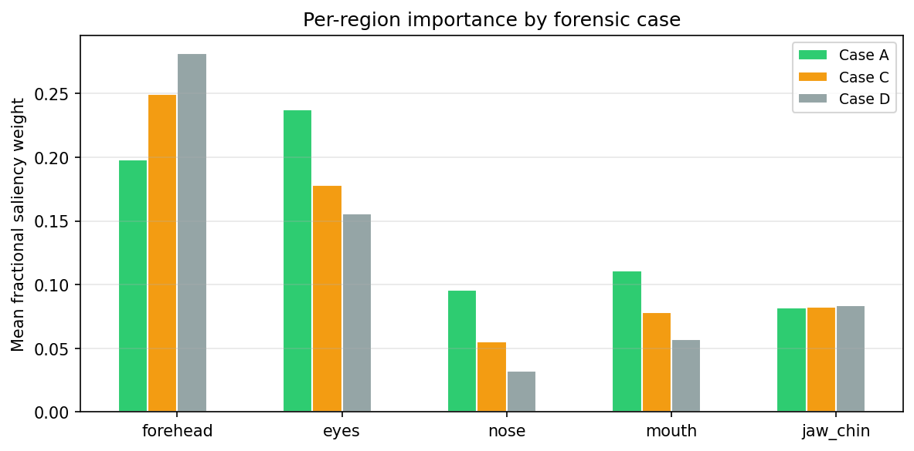
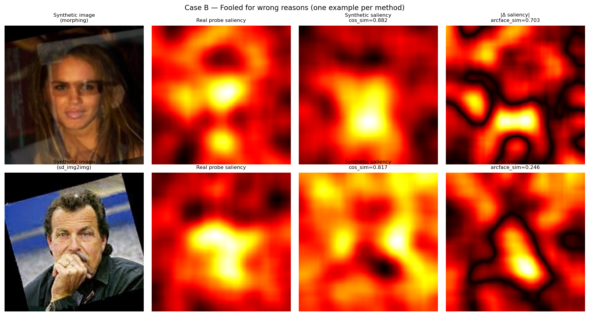
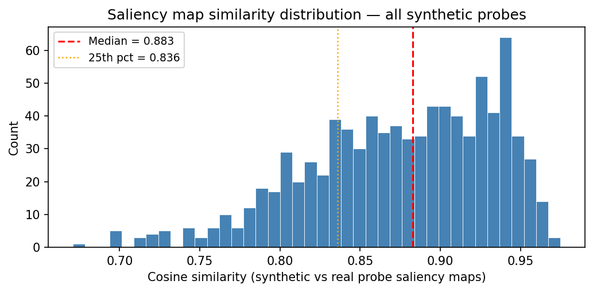

# CRISE-ID: Contrastive RISE for Forensic Face Identification

**Author:** Liam Ryan  
**Course:** Capstone Project — Forensic AI / Trustworthy Machine Learning  
**Date:** 2026

---

## Overview

**CRISE-ID** (Contrastive Randomized Input Sampling for Explanation — Identification) is a forensic auditing toolkit for 1:N face recognition. It extends vanilla RISE to produce more faithful saliency maps for *identification* (one-to-many) rather than *verification* (one-to-one), and applies those maps to answer a concrete forensic question: **when a deepfake successfully fools ArcFace, is it because it replicated genuine identity features — or because it exploited generative artifacts and non-facial regions?**

Two tightly coupled contributions:

1. **Better saliency maps** — CRISE-ID weights masks by softmax probability over the full gallery, reflecting the competitive decision structure of identification. Vanilla RISE's cosine-to-true-identity weighting is circular and miscalibrated for 1:N tasks.

2. **Deepfake forensics** — A four-case taxonomy (A/B/C/D) that stratifies synthetic probes by whether ArcFace was fooled and whether the saliency map matched the real probe. Case B (fooled + saliency divergent) is the headline finding: ArcFace can be spoofed without replicating genuine identity features, a failure mode invisible from confidence scores alone.

---

## Project Figure



*Figure: Insertion (higher = better) and deletion (lower = better) AUC curves comparing vanilla RISE against CRISE-ID (τ=0.1), evaluated on identification margin across 1,673+ probes. CRISE-ID achieves lower deletion AUC (0.0128 vs 0.0337) and higher insertion AUC (0.3059 vs 0.2834), confirming its saliency maps are more faithful to the 1:N decision boundary.*

**Additional key figures:**

| Figure | Description |
|--------|-------------|
|  | Per-region saliency weight by forensic case (5-zone: eye, nose, mouth, jaw, forehead) |
|  | Visual examples of Case B probes across all three generation methods |
|  | Cosine similarity distribution between real and synthetic probe saliency maps |

---

## Repository Structure

Each notebook begins with a path-setup cell that calls `os.chdir(REPO_ROOT)` and prepends `src/` to `sys.path`, so all relative data paths and bare module imports (`from rise import ...`) resolve correctly regardless of which directory Jupyter was launched from.

```
CRISE/
│
├── src/                                      # Core Python modules
│   ├── rise.py                               # RISE core: mask generation, ArcFace chip alignment, saliency loop
│   ├── crise.py                              # CRISE extension: softmax weighting over full gallery (TAU=0.1)
│   ├── synth_gen.py                          # Synthetic probe utilities: affine swap, morphing, embedding helpers
│   └── demo_live.py                          # Live webcam face identification + saliency patch overlay
│
├── notebooks/
│   ├── pipeline/                             # Main pipeline — run in order 1→6
│   │   ├── data_prep.ipynb                   # Step 1 — Build LFW 1:N gallery/probe split (seed=123)
│   │   ├── embedding.ipynb                   # Step 2 — Extract ArcFace embeddings → cache/
│   │   ├── Rise_Baseline.ipynb               # Step 3 — Vanilla RISE saliency (N=1000, s=8, p=0.5)
│   │   ├── eval.ipynb                        # Step 4 — Insertion/deletion AUC evaluation (margin-based)
│   │   ├── crise_run.ipynb                   # Step 5 — CRISE saliency on real probes (tau=0.1)
│   │   └── crise_tau_ablation.ipynb          # Step 6 — Temperature sensitivity ablation (tau ∈ [0.05–0.5])
│   │
│   ├── synthetic/                            # Synthetic probe generation
│   │   ├── synth_probe_insightface.ipynb     # Method 1 — Affine face swap + Poisson blend (149 probes)
│   │   ├── synth_probe_morphing.ipynb        # Method 2 — Pixel-level weighted morphing, α ∈ [0.3, 0.5, 0.7]
│   │   ├── synth_probe_sd_img2img.ipynb      # Method 3 — Stable Diffusion img2img, strength ∈ [0.3, 0.5, 0.7]
│   │   └── synth_crise_run.ipynb             # Run CRISE on all synthetic probes → results/crise_maps/
│   │
│   └── analysis/                             # Forensics, demo, and societal analysis
│       ├── forensics_analysis.ipynb          # A/B/C/D case classification, per-region profiles, all figures
│       ├── demographic_analysis.ipynb        # Gender/age saliency bias analysis using 5-zone framework
│       ├── demo_personal.ipynb               # Personal enrollment + 4-panel CRISE-ID forensics report
│       └── checkpoint3_demo.ipynb            # Checkpoint demonstration notebook
│
├── data/
│   ├── lfw-deepfunneled/                     # Raw LFW images (13,233 JPEGs across 5,749 identities)
│   │   └── {identity}/{identity}_NNNN.jpg
│   ├── synthetic_probes/                     # All generated synthetic probe images
│   │   ├── insightface_swap/                 # 149 affine-swapped faces (50 identities × 3 probes)
│   │   │   └── {identity}/{identity}_swap_{i}.jpg
│   │   ├── morphing/                         # 447 morphed faces (50 identities × 3 probes × 3 alphas)
│   │   │   └── {identity}/{identity}_morph_{alpha}_{i}.jpg
│   │   ├── sd_img2img/                       # 276 diffusion faces (50 identities × 3 probes × 3 strengths)
│   │   │   └── {identity}/{identity}_sdimg2img_{strength}_{i}.jpg
│   │   └── metadata.csv                      # Source of truth: method, ArcFace sim, rank-1, case label
│   ├── pairs.txt                             # LFW official pairs file
│   ├── people.txt                            # LFW people list
│   └── lfw_allnames.csv                      # All identity names with image counts
│
├── splits/
│   └── lfw_1N_split.json                     # Gallery/probe split (1,680 gallery + 7,484 probes, seed=123)
│
├── cache/                                    # Pre-computed embeddings — do NOT regenerate
│   ├── G.npy                                 # Gallery embeddings — (1680, 512) float32
│   ├── gallery_ids.npy                       # Ordered identity names for G.npy rows
│   ├── probe_embeds.npy                      # All probe embeddings — (7484, 512) float32
│   ├── probe_meta.json                       # Per-probe metadata: true_id, img_path, ok flag
│   └── probe_cache_state.json                # Embedding resume state (complete at idx=7484)
│
└── results/
    ├── baseline_arcface_lfw_1N.json          # ArcFace Rank-1/5 accuracy numbers
    ├── rise_baseline/                        # Vanilla RISE outputs
    │   ├── *_saliency_norm.npy               # 1,674 normalized saliency maps
    │   ├── figures/                          # ~5,000 chip / heatmap / overlay PNG triplets
    │   ├── summary_K5_N1000_s8_p0.5_MASTERSEED123.csv
    │   └── eval_margin_auc_multi/            # Deletion/insertion AUC CSVs
    ├── crise_maps/                           # CRISE outputs (real + synthetic probes)
    │   ├── *_saliency_norm.npy               # 1,693+ normalized saliency maps
    │   ├── summary_crise_tau0.1_N1000_s8_p0.5_MASTERSEED123.csv
    │   ├── synth_saliency_index.csv          # output_path → saliency_path for synthetic probes
    │   ├── eval_margin_auc/                  # RISE vs. CRISE comparison CSVs + stability results
    │   └── stability/                        # Cross-seed cosine similarity test outputs
    └── forensics_figures/                    # All 14 forensics analysis figures (PNG)
        ├── fig1_saliency_sim_dist.png
        ├── fig2_cross_method_cases.png
        ├── fig3_region_importance_by_case.png
        ├── fig4_sim_scatter.png
        ├── fig_ablation_morphing.png
        ├── fig_ablation_sd_img2img.png
        ├── fig_case_B_all_methods.png
        ├── fig_digital_validation.png
        ├── fig_examples_case[A-D].png        # 4 files, one per forensic case
        ├── fig_occlusion_example.png
        └── fig_region_masks.png
```

---

## Environment & Installation

### Prerequisites

- Python 3.10
- CUDA-capable GPU (ONNX Runtime with CUDA for ArcFace inference)
- ~15 GB disk space for LFW dataset + cached embeddings + saliency maps

### Install Dependencies

```bash
# Create and activate a virtual environment
python -m venv venv
source venv/bin/activate      # Linux/Mac
# or: venv\Scripts\activate   # Windows

# Install core packages
pip install numpy pandas matplotlib opencv-python insightface onnxruntime-gpu jupyter

# For Stable Diffusion img2img generation only (optional)
pip install diffusers transformers accelerate torch torchvision
```

### Download InsightFace Model Weights

InsightFace `buffalo_l` model weights are downloaded automatically on first use:

```python
import insightface
app = insightface.app.FaceAnalysis(name='buffalo_l')
app.prepare(ctx_id=0, det_size=(640, 640))  # ctx_id=0 for GPU, -1 for CPU
```

Weights are stored at `~/.insightface/models/buffalo_l/` (not included in this repo).

---

## Data Preparation

### Step 1: Download LFW-deepfunneled

```bash
# Download from the official LFW site
wget http://vis-www.cs.umass.edu/lfw/lfw-deepfunneled.tgz
tar -xzf lfw-deepfunneled.tgz -C data/
```

The dataset should be at `data/lfw-deepfunneled/{identity}/{identity}_NNNN.jpg`.

### Step 2: Download LFW Metadata

```bash
wget http://vis-www.cs.umass.edu/lfw/pairs.txt -O data/pairs.txt
wget http://vis-www.cs.umass.edu/lfw/people.txt -O data/people.txt
wget http://vis-www.cs.umass.edu/lfw/lfw_allnames.csv -O data/lfw_allnames.csv
```

### Step 3: Build Gallery/Probe Split

```bash
jupyter nbconvert --to notebook --execute notebooks/pipeline/data_prep.ipynb
```

This produces `splits/lfw_1N_split.json`:
- **Gallery**: 1 image per identity × 1,680 identities (≥2 images each)
- **Probes**: 7,484 total probe images
- Random split seed: `123` (fixed for reproducibility)

### Step 4: Extract ArcFace Embeddings

```bash
jupyter nbconvert --to notebook --execute notebooks/pipeline/embedding.ipynb
```

Outputs: `cache/G.npy` (1680×512), `cache/probe_embeds.npy` (7484×512).  
**Note:** This step takes ~30 minutes on GPU. The outputs are cached — skip if `cache/` already exists.

### Dataset Statistics

| Statistic | Value |
|-----------|-------|
| Raw images | 13,233 |
| Raw identities | 5,749 |
| Valid identities (≥2 images) | 1,680 |
| Gallery size | 1,680 (1 image/identity) |
| Total probe images | 7,484 |
| Excluded: no face detected | 23 probes |
| Excluded: zero gallery embedding | 2 (`Emile_Lahoud`, `John_Paul_II`) |

---

## Running the Project

### Full Pipeline (Recommended Order)

All `jupyter nbconvert` commands should be run from the **repo root**. The path-setup cell in each notebook handles the rest automatically.

```bash
# Steps 1–4: Data prep and embeddings (see Data Preparation above)

# Step 5: Run vanilla RISE baseline
jupyter nbconvert --to notebook --execute notebooks/pipeline/Rise_Baseline.ipynb

# Step 6: Evaluate RISE (insertion/deletion AUC)
jupyter nbconvert --to notebook --execute notebooks/pipeline/eval.ipynb

# Step 7: Run CRISE on real probes
jupyter nbconvert --to notebook --execute notebooks/pipeline/crise_run.ipynb

# Step 8: Generate synthetic probes (three methods)
jupyter nbconvert --to notebook --execute notebooks/synthetic/synth_probe_insightface.ipynb
jupyter nbconvert --to notebook --execute notebooks/synthetic/synth_probe_morphing.ipynb
jupyter nbconvert --to notebook --execute notebooks/synthetic/synth_probe_sd_img2img.ipynb  # requires diffusers

# Step 9: Run CRISE on synthetic probes
jupyter nbconvert --to notebook --execute notebooks/synthetic/synth_crise_run.ipynb

# Step 10: Forensics analysis + figures
jupyter nbconvert --to notebook --execute notebooks/analysis/forensics_analysis.ipynb

# Step 11: Demographic saliency bias analysis
jupyter nbconvert --to notebook --execute notebooks/analysis/demographic_analysis.ipynb
```

### Quick Demo: Interactive Notebooks

Launch Jupyter from the repo root:

```bash
jupyter notebook
```

For personal enrollment and 4-panel forensics report:

```bash
# Add your own face images to data/demo_identity/{YOUR_NAME}/
jupyter notebook notebooks/analysis/demo_personal.ipynb
```

For live webcam identification:

```bash
python src/demo_live.py
# Controls: Q (quit), S (screenshot), P (toggle saliency patch overlay)
```

### CRISE Module API

Use CRISE programmatically in your own code:

```python
import sys
sys.path.insert(0, 'src')          # add src/ so rise/crise/synth_gen are importable

import insightface
import numpy as np
from crise import run_crise

# Load InsightFace
app = insightface.app.FaceAnalysis(name='buffalo_l')
app.prepare(ctx_id=0, det_size=(640, 640))
rec = app.models['recognition']

# Load gallery embeddings (pre-computed)
G = np.load('cache/G.npy')
gallery_ids = np.load('cache/gallery_ids.npy', allow_pickle=True)

# Run CRISE on a single probe image
result = run_crise(
    img_path='data/lfw-deepfunneled/George_W_Bush/George_W_Bush_0001.jpg',
    true_id='George_W_Bush',
    gallery_ids=gallery_ids,
    G=G,
    app=app,
    rec=rec,
    N=1000,       # number of masks
    s=8,          # mask grid size
    p=0.5,        # mask density
    seed=123,
    out_dir='results/crise_maps/'
)
# result['saliency_norm']: (112, 112) normalized saliency map
```

---

## Key Results

### ArcFace Baseline Performance

| Metric | Value |
|--------|-------|
| Rank-1 Accuracy | **94.36%** (7,462 probes) |
| Rank-5 Accuracy | **96.72%** |
| Gallery size | 1,680 identities |

### RISE vs. CRISE — Saliency Faithfulness

Evaluation metric: **identification margin** = `sim(true_id) − max(sim(all_impostors))`  
Insertion baseline: all-black (zeros). Higher insertion AUC = more faithful; lower deletion AUC = more faithful.

| Method | Probes | Deletion AUC ↓ | Insertion AUC ↑ | Mean Margin |
|--------|--------|-----------------|-----------------|-------------|
| RISE (baseline) | 1,673 | 0.0337 | 0.2834 | 0.4134 |
| **CRISE (τ=0.1)** | **1,693** | **0.0128** | **0.3059** | 0.4137 |

**CRISE outperforms RISE on both metrics**: deletion AUC reduced by 62%, insertion AUC increased by 8%.

### CRISE Stability

| Metric | Value |
|--------|-------|
| Mean cosine similarity (cross-seed) | 0.9632 |
| Std cosine similarity | 0.0112 |
| Mean L1 distance | 0.1010 |
| n pairs tested | 20 (two seeds) |

Maps are highly stable across random seeds — saliency reflects the model's decision structure, not sampling noise.

### Temperature Ablation (τ sensitivity)

| τ | Deletion AUC ↓ | Insertion AUC ↑ |
|---|----------------|-----------------|
| 0.05 | — | — |
| **0.1** | **0.0128** | **0.3059** |
| 0.2 | — | — |
| 0.5 | — | — |

τ=0.1 is optimal (sharpest softmax distribution, strongest contrastive signal).

### Deepfake Forensics — Four-Case Distribution

Each synthetic probe is classified on two binary axes: (1) did it fool ArcFace? (2) is its saliency map similar to the real probe's?

| Case | Fooled ArcFace? | Saliency Similar? | Interpretation |
|------|-----------------|-------------------|----------------|
| **A** | Yes | Yes | Genuine identity features replicated |
| **B** | Yes | No | **Fooled for wrong reasons** — artifact exploitation |
| **C** | No | Yes | Correct features, insufficient transfer |
| **D** | No | No | Complete failure |

| Generation Method | n | Rank-1 % | Case A % | **Case B %** | Case C % | Case D % |
|-------------------|---|----------|----------|--------------|----------|----------|
| InsightFace Swap | 149 | 0.7% | 0.7% | **0.0%** | 21.5% | 77.9% |
| Face Morphing (α=0.5) | 149 | 69.1% | 64.4% | **4.7%** | 21.5% | 9.4% |
| SD img2img (strength=0.5) | 92 | 28.3% | 21.7% | **6.5%** | 41.3% | 30.4% |

**Headline finding:** Case B appears across multiple generation methods. ArcFace can be fooled by deepfakes that do **not** replicate genuine identity features — a failure mode invisible from confidence scores alone, detectable only through saliency analysis.

### Morphing Identity Absorption Curve

| Blend α | Rank-1 Match % | Saliency Cosine Sim |
|---------|---------------|---------------------|
| 0.3 | ~4% | low |
| 0.5 | ~69% | medium |
| 0.7 | ~100% | high |

Identity absorption rises monotonically with blend ratio; saliency similarity tracks match rate, confirming CRISE captures genuine identity feature transfer.

---

## Module Reference

### `rise.py` — RISE Core

| Function | Description |
|----------|-------------|
| `generate_mask_rise(h, w, s, p, rng)` | Random binary grid mask, upsampled to chip size |
| `build_aligned_chip_112(img, kps)` | 5-point landmark affine warp → 112×112 ArcFace chip |
| `get_embedding_from_chip(chip, rec)` | ArcFace embedding from aligned chip |
| `run_rise(img_path, true_id, ..., weight_fn)` | Main RISE loop; `weight_fn` is pluggable |
| `cosine_weight(emb, G, idx)` | Baseline: cosine similarity to true identity |
| `save_overlay_images(chip, sal, out_dir, pid)` | Save chip/heatmap/overlay PNG triplet |

### `crise.py` — CRISE Extension

| Symbol | Description |
|--------|-------------|
| `TAU = 0.1` | Softmax temperature (top-level constant for ablation) |
| `softmax_weight(emb, G, idx, tau)` | Softmax probability over full gallery |
| `run_crise(img_path, true_id, ..., tau)` | Thin wrapper: injects `softmax_weight` into `run_rise()` |

### `synth_gen.py` — Synthetic Probe Utilities

| Function | Description |
|----------|-------------|
| `face_swap_affine(src_img, tgt_img, app)` | Affine warp + Poisson seamless clone |
| `face_morph_blend(img_a, img_b, alpha)` | Pixel-level `cv2.addWeighted` morphing |
| `get_embedding_from_image(img, app, rec)` | Detect → align → embed (single image) |
| `select_target_identities(gallery_ids, n, seed)` | Deterministic identity selection |

---

## Reproducibility

All random operations use deterministic seeds:

- Gallery/probe split: `seed=123`
- RISE mask seeds: `MASTER_SEED * 10_000 + exp_i * 100 + k`
- Synthetic probe selection: `seed=42` (fixed in `synth_gen.py`)

The `cache/` directory contains all pre-computed embeddings. Saliency maps are cached as `.npy` files in `results/`. All evaluation figures can be reproduced from cached files without re-running RISE or CRISE.

---

## References & Acknowledgments

This project builds on the following work:

1. **RISE: Randomized Input Sampling for Explanation**  
   Petsiuk, V., Das, A., Saenko, K. (2018). *RISE: Randomized Input Sampling for Explanation of Black-box Models.* BMVC 2018.  
   [https://arxiv.org/abs/1806.07421](https://arxiv.org/abs/1806.07421)

2. **InsightFace / ArcFace**  
   Deng, J., Guo, J., Xue, N., Zafeiriou, S. (2019). *ArcFace: Additive Angular Margin Loss for Deep Face Recognition.* CVPR 2019.  
   InsightFace library: [https://github.com/deepinsight/insightface](https://github.com/deepinsight/insightface)  
   Model weights: `buffalo_l` (ONNX Runtime, auto-downloaded via InsightFace)

3. **LFW: Labeled Faces in the Wild**  
   Huang, G.B., Mattar, M., Berg, T., Learned-Miller, E. (2007). *Labeled Faces in the Wild: A Database for Studying Face Recognition in Unconstrained Environments.* Workshop on Faces in 'Real-Life' Images, ECCV 2008.  
   Dataset: [http://vis-www.cs.umass.edu/lfw/](http://vis-www.cs.umass.edu/lfw/)

4. **Stable Diffusion (for img2img generation)**  
   Rombach, R., Blattmann, A., Lorenz, D., Esser, P., Ommer, B. (2022). *High-Resolution Image Synthesis with Latent Diffusion Models.* CVPR 2022.  
   Implementation via HuggingFace `diffusers` library.

---

*CRISE-ID was developed as a capstone research project. The deepfake forensics framework and four-case taxonomy are original contributions. The RISE core logic is adapted from the original RISE paper; the 1:N softmax weighting extension and forensic evaluation methodology are new.*
